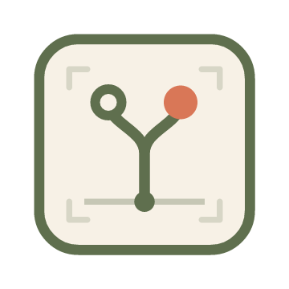
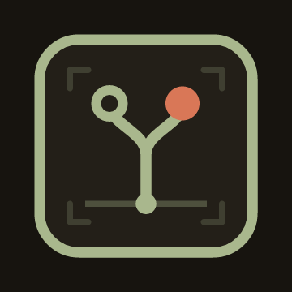
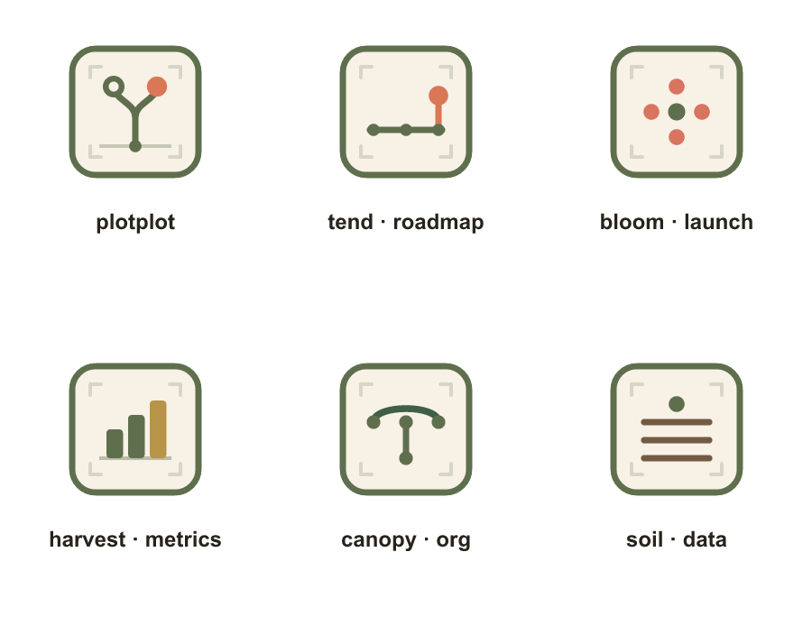
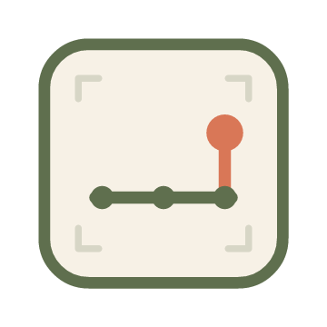
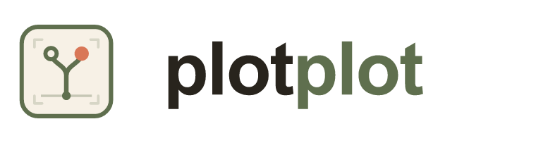

# plotplot — Brand System

**Version:** v1.1.0 (reconciled with the shipped `tend` product)
**Supersedes:** the v1.0.0 written spec (`identity.md`, `colors.md`, `typography.md`, `DESIGN.md`, `voice.md`)
**Tagline:** *Grow what matters.*

> This document keeps everything the v1.0.0 spec got right (the cultivation
> metaphor, the botanical-archive palette, the calm/precise/literate voice, the
> 13-product portfolio) and fixes the four places where it diverged from the one
> product that actually ships — **tend**. The supplied system was written in the
> abstract, with **no visual assets and no knowledge of how tend really looks**.
> Reconciling the two makes the parent brand *containable*: a brand tend can wear
> without breaking its own locked principles.

---

## 0. The one idea

**plotplot gives a company a living map; tend is that map for the product roadmap.**

tend already does, at the roadmap layer, exactly what plotplot promises at the
company layer: a living map of *what you believe, what you're building, how you
prove it, and where the work is sprawling.* tend is not a logo exercise bolted
onto a brand deck — it is **the first shipped proof of the plotplot thesis.** The
brand must therefore sync *toward* tend's real identity, not the other way
around. Where the v1.0.0 spec and the shipped product disagree, **the shipped
product wins** — it exists, it renders, it's real.

---

## 1. What changed from v1.0.0, and why

The brief was "improve on these assets and make plotplot *in sync with* tend."
Four substantive reconciliations, then the assets the spec never had.

| # | v1.0.0 said | Reconciled to | Why |
|---|---|---|---|
| **1. tend's accent** | Tend product accent = `#6F8157` (a moss green) | **`#D97757`** (clay) | tend *ships* clay `#D97757` as `--accent` in every rendered artifact. `#6F8157` was assigned without seeing the product. This is the keystone fix. |
| **2. The warm accent** | Family accent "bloom coral" = `#C97863` | **`#D97757`** | `#C97863` was a near-miss for tend's real clay. Collapse them: the family's single warm "bloom" accent *is* tend's clay. So the **"Grow what matters" accent is literally tend-colored** — the roadmap-tending product wears the family's bloom on purpose. |
| **3. Type system** | "Google Fonts only" (Sora / Source Sans 3 / JetBrains Mono) | **Two tiers** — web tier keeps Google Fonts; **artifact tier is self-contained** (system stacks + serif prose) | tend's locked first principle is the **self-contained polyglot**: a `.tend.html` must render offline with *no CDN*. The CSS even says so: `No external imports. No CDN fonts.` A brand that mandates Google Fonts everywhere cannot contain tend. |
| **4. Status colors** | Semantic palette diverges from tend's glyph colors | **One reconciled status language** (§4.4) | A failed check in tend and an error in a plotplot dashboard should be the *same* red. Anchor the shared semantics in tend's actually-rendered glyph colors. |
| **5. Visual identity** | *(none — the spec had zero marks or icons)* | **A full mark system** (§3) | The single biggest gap. plotplot had a voice and a palette but no face. §3 gives it one, built from the exact primitives the spec's own iconography section asks for. |

Everything else from v1.0.0 — the brand story, the visual principles ("show
relationships not lists," "prefer maps over dashboards," "support pruning"), the
voice traits, the forbidden-terms list — carries forward **unchanged**. It was
good work; it just needed a face and a reality check.

---

## 2. Identity

| Field | Value |
|---|---|
| Name | plotplot |
| Tagline | Grow what matters. |
| Category | Company Coherence Platform |
| Mission | Help teams grow coherent companies by connecting product planning, brand consistency, market signals, and company memory. |
| Vision | Companies that build with clearer direction, stronger coherence, and better awareness of the terrain around them. |

**Story (unchanged from v1.0.0).** Most companies don't fail for lack of ideas;
they fail because their ideas grow in different directions. The roadmap drifts
from the strategy, the brand says different things in different places, signals
sit in scattered tools, and decisions are made, forgotten, and contradicted.
plotplot is the living map: what the company believes, what it's building, how it
speaks, what the market signals back, and where the work is starting to sprawl.
The language is cultivation because **coherent companies are grown, not
assembled** — ideas are planted, roadmaps are tended, weak work is pruned,
launches bloom, outcomes are harvested into memory.

**tend's place in the story.** Of the 13 products, **tend (Roadmap) is the one
that exists today.** It is the proof that the plotplot pattern — *make a bet,
prove it, keep the map honest* — works in a real codebase. Read tend as
plotplot's beachhead: the same "living map + visible coherence + active pruning"
idea, shipped first at the layer where drift hurts soonest (the product roadmap),
ready to extend outward to strategy (Stem), brand (Petal), signals (Cultivate),
and memory (Soil).

---

## 3. The mark system

The v1.0.0 spec described how icons should *feel* ("thin linework, rounded-but-
not-cute geometry, small coordinate marks, nodes, roots, stems, plots, labels,
directional paths") but drew nothing. This is that system, built from exactly
those primitives.

> **All marks in this section were rendered through tend's own renderer**
> (`@resvg/resvg-js`, the engine behind `tend preview-thumbnail`). The brand
> assets are produced *by the product they brand.* Regenerate with
> `node docs/brand/build-assets.mjs`. Sources: `docs/brand/assets/*.svg`.

### 3.1 The master mark — "the living plot"



A **plot tile** (rounded square — a cultivated bed *and* a map cell) holds:

- **faint coordinate ticks** at the inner corners — the *plotted field*; the
  "small coordinate marks" the spec asked for, as a reward-for-looking detail
  that disappears gracefully at favicon scale;
- a **grounded baseline** with a root node — the work is rooted, not floating;
- a **branch** rising to **two outcomes** — an *open* node (the bet not yet
  proven) and the **clay bloom** (what mattered, grown). The asymmetry is the
  message: you tend many branches; one blooms.

It reads as map, cultivation, and "grow what matters" in one closed glyph, and it
holds together from 360px down to a 40px favicon:


**Dark mode** ("dark soil at night, not a harsh developer theme"): moss lifts to
`#A9B78D`, paper drops to the `#231F18` surface, the bloom stays warm.



### 3.2 The family chassis — one tile, thirteen identities

Every product mark is **the same plot tile + the same corner ticks (the
endorsement) + one distinct glyph in the product's accent.** This is the
endorsed-brand architecture: the green tile says *plotplot*, the glyph + accent
say *which product*.



The glyph recipe (drawn from the spec's own primitives):

| Product | Role | Glyph | Accent |
|---|---|---|---|
| **plotplot** | the platform | branch → bloom | `#D97757` |
| **tend** | Roadmap | a tended roadmap row, last node grown | `#D97757` |
| Bloom | Launch | a four-petal bloom | `#D8745F` |
| Harvest | Outcomes | ascending yield bars | `#B89448` |
| Canopy | Leadership | an org arc over trunk nodes | `#3F5F46` |
| Soil | Memory | stratified ground + a seed | `#735A43` |

The remaining seven (Root, Seed, Stem, Petal, Prune, Graft, Cultivate, Weather)
follow the same recipe — one legible glyph from {node, stem, root, plot-line,
coordinate tick, directional path}, in the product accent from §4.3, on the
shared tile. **Rule: one glyph idea per tile, ≤ 6 marks, no compound scenes.**
(That budget is lifted straight from tend's own diagram-density rules in
`tend-narrate` — the brand and the product share an icon grammar.)

### 3.3 tend's product mark



Where the master mark **branches up** (the whole system grows from a point),
tend **progresses across**: a roadmap row of nodes with the final one *tended* —
grown on a clay stem. The distinction encodes the products' jobs: plotplot grows
the company; tend tends the line. **tend's mark carries the family bloom
(`#D97757`) as its own accent** — the visual statement of reconciliation #2.

### 3.4 Lockup & wordmark



Mark + wordmark, set in **Sora 600**, lowercase, tight tracking. The wordmark is
two-tone — `plot` in soil-black, `plot` in moss — which does double duty: it
articulates the doubled name *and* states the parent→product relationship (the
core in soil, the cultivation system in green) in the logotype itself.

> Production wordmarks should be **outlined** from Sora so they're font-
> independent. The source SVG references `font-family: Sora` and previews with a
> system fallback; outline before shipping to print or third parties.

### 3.5 Clear space, sizing, don'ts

- **Clear space:** one tile-corner-radius (≈ 13% of the mark's width) on all sides.
- **Minimum size:** 16px (mark only — ticks drop out cleanly); 88px for the lockup.
- **Don't:** recolor the tile per product (the green tile *is* the endorsement);
  add a third color to a glyph; fill the tile with the accent; set the wordmark
  in anything but Sora / its outlines; add gradients, shadows, or a mascot.

---

## 4. Color

### 4.1 Primary palette

| Role | Hex | Notes |
|---|---|---|
| Primary | `#5F6F4E` | moss green — primary actions, selected states, the mark's tile |
| **Accent (bloom)** | **`#D97757`** | **the single warm accent** — CTAs, launch/confirm, "what matters." *Was `#C97863`.* |
| Text | `#28241D` | soil-black — marketing & UI headings |
| Surface | `#EFE7D8` | cards, panels, grouped sections |
| Border | `#D8CCB8` | dividers, card & input borders |
| Background (marketing) | `#F7F1E6` | warm paper — plotplot.com, the app shell |
| Background (artifact) | `#fbfaf8` / `#f5f3ee` | tend's polyglot surface runs a few shades **lighter** — dense long-form reading wants more luminance than a landing page. Same warmth, higher value. |

**Why two papers.** The marketing tier is a deep, tactile paper (`#F7F1E6`); the
artifact tier (a `.tend.html` you read for an hour) is a lighter warm-white
(`#fbfaf8`). They're the same hue family at different luminance — a deliberate
context split, not a clash.

### 4.2 The single warm accent (keystone)

There is exactly **one** warm accent in the system: **clay `#D97757`** — tend's
shipped `--accent`. It is "the bloom": used sparingly for the moment that
matters (a CTA, a launch, a confirm, the one branch that grew). In dark mode it
**lifts to `#E0866B`** for contrast (mirroring how the primary lifts to
`#A9B78D`) — tend already ships this exact lift.

This collapses the v1.0.0 redundancy where a family "bloom coral" accent
(`#C97863`) and a "Bloom" launch product (`#D8745F`) and tend's real clay
(`#D97757`) all crowded the same hue. Now: **one warm accent (`#D97757`)**; the
*Bloom product* keeps a distinctly deeper, pinker coral (`#D8745F`) so the launch
product reads apart from the system accent. Glyph + label carry the rest of the
distinction.

### 4.3 Product accents

Shared primary palette across all products; each product owns one accent for
nav markers, badges, product headers, and chart highlights — **never** as a
full-screen theme.

| Product | Accent | | Product | Accent |
|---|---|---|---|---|
| Root | `#4B3A2A` | | Graft | `#5F8A7A` |
| Soil | `#735A43` | | Cultivate | `#5E7F8D` |
| Seed | `#A6A15F` | | Weather | `#7D8790` |
| **Tend** | **`#D97757`** ⟵ *was `#6F8157`* | | Bloom | `#D8745F` |
| Stem | `#4E6A4A` | | Harvest | `#B89448` |
| Petal | `#D39586` | | Canopy | `#3F5F46` |
| Prune | `#5B5A52` | | | |

### 4.4 Semantic / verdict palette (one status language)

So a tend cockpit verdict and a plotplot dashboard speak the **same** colors.
Anchored in tend's actually-rendered glyph colors (real > aspirational); slate
"info" adopted from v1.0.0 (tend ships none).

| Role | Reconciled | plotplot dashboard | tend artifact |
|---|---|---|---|
| Healthy / Sound / **verified** | `#4F7942` | success, healthy sync | `--glyph-verified` |
| Caution / Warning / **in-progress** | `#C9923C` | review-needed, drift | `--glyph-implemented` / `--glyph-partial` |
| Error / Broken / **failed** | `#B85C3E` | destructive, failed check | `--glyph-failed` |
| Info / neutral signal | `#587383` | source notes, guidance | *(n/a)* |
| Bloom / CTA / what-matters | `#D97757` | launch, confirm | `--accent` |
| Draft / muted / missing | `#8A8A86` | not-yet-defined | `--glyph-draft` |

> The healthy green `#4F7942` is deliberately distinct from the moss *primary*
> `#5F6F4E` — a status color must not blend into the brand's structural green, or
> "verified" disappears.

### 4.5 CSS custom properties

```css
:root {
  /* shared family palette */
  --pp-primary:    #5F6F4E;
  --pp-accent:     #D97757;   /* the bloom — was #C97863 */
  --pp-text:       #28241D;
  --pp-surface:    #EFE7D8;
  --pp-border:     #D8CCB8;
  --pp-bg:         #F7F1E6;   /* marketing paper */
  --pp-bg-artifact:#fbfaf8;   /* tend's lighter long-read paper */

  /* reconciled status (matches tend's glyph colors) */
  --pp-healthy: #4F7942;
  --pp-caution: #C9923C;
  --pp-error:   #B85C3E;
  --pp-info:    #587383;
  --pp-muted:   #8A8A86;

  /* product accents */
  --pp-tend: #D97757;  /* was #6F8157 */
  --pp-bloom: #D8745F; --pp-harvest: #B89448; --pp-canopy: #3F5F46;
  --pp-soil: #735A43;  --pp-root: #4B3A2A;    --pp-seed: #A6A15F;
  --pp-stem: #4E6A4A;  --pp-petal: #D39586;   --pp-prune: #5B5A52;
  --pp-graft: #5F8A7A; --pp-cultivate: #5E7F8D; --pp-weather: #7D8790;
}

[data-theme="dark"] {
  --pp-primary: #A9B78D;
  --pp-accent:  #E0866B;   /* clay lifts for dark contrast */
  --pp-text:    #EFE7D8;
  --pp-surface: #231F18;
  --pp-border:  #453C30;
  --pp-bg:      #17140F;   /* dark soil at night */
}
```

---

## 5. Typography — two tiers, one voice

The v1.0.0 spec said "Google Fonts only." tend's locked first principle says the
opposite for its artifacts: **self-contained, no CDN.** Both are right *for their
surface.* The system has two tiers that echo each other.

### Tier 1 — Networked surfaces (plotplot.com, app, dashboards, marketing)

The full editorial brand. Google Fonts, exactly as v1.0.0 specified.

| Role | Font | Weights |
|---|---|---|
| Headings | **Sora** | 600, 700 — distinctive, literate, geometric |
| Body / Interface | **Source Sans 3** | 400, 500, 600 |
| Code | **JetBrains Mono** | 400, 500 |

```css
@import url('https://fonts.googleapis.com/css2?family=JetBrains+Mono:wght@400;500&family=Sora:wght@600;700&family=Source+Sans+3:wght@400;500;600;700&display=swap');
:root {
  --font-heading: 'Sora', system-ui, sans-serif;
  --font-body:    'Source Sans 3', system-ui, sans-serif;
  --font-code:    'JetBrains Mono', ui-monospace, monospace;
}
```

### Tier 2 — Self-contained artifacts (every `.tend.html`, offline-first)

No `@import`, no CDN. Stacks that **degrade to the brand's spirit** with zero
network — exactly what tend ships today.

| Role | Stack | Why it stays on-brand |
|---|---|---|
| Prose / body | `ui-serif, Georgia, "Times New Roman", serif` | The brand calls Sora "**literate**." A serif long-read register *is* literate — it reads as the "**intelligent archive / field journal**" the illustration section asks for. tend's narratives ship this today. |
| Interface / labels | `system-ui, -apple-system, "Segoe UI", Roboto, sans-serif` | Neutral, warm, instantly available — the offline echo of Source Sans 3. |
| Code | `'IBM Plex Mono', ui-monospace, "SF Mono", Menlo, monospace` | IBM Plex Mono is the self-contained sibling of JetBrains Mono — same compact, legible developer voice; uses the local copy if present, falls back cleanly. |

**The bridge.** Tier 1 is the *poster*; Tier 2 is the *field journal*. Sora's
geometric-literate headings and a serif long-read body are two expressions of the
same "literate, not playful" instruction. A reader moving from plotplot.com (Sora
+ Source Sans 3) into a shipped `.tend.html` (serif prose + system UI) feels one
brand at two temperatures — never a CDN stall, never a broken offline page.

### Shared type scale (both tiers)

| Level | Size | LH | Weight |
|---|---|---|---|
| h1 | 44px | 1.2 | 700 |
| h2 | 32px | 1.25 | 700 |
| h3 | 24px | 1.3 | 600 |
| h4 | 18px | 1.35 | 600 |
| body | 16px | 1.5 | 400 |
| small | 14px | 1.4 | 400 |
| code | 13px | 1.5 | 400 |

Spacing: a 4px grid (`4 · 8 · 12 · 16 · 24 · 32 · 48 · 64 · 96`).

---

## 6. Iconography — tend's thumbnails *are* the brand icon system

The spec's icon rules ("thin linework, coordinate marks, nodes, roots, stems,
plots, directional paths — *not* cartoon plants, emoji, sparkles, heavy fills, or
decorative AI motifs") describe **tend's existing thumbnail system exactly.** Every
tend feature, persona, and opportunity already ships a node/stem/plot SVG glyph,
authored by `tend-narrate` and rendered through resvg. So:

- The brand icon library **is** tend's glyph grammar — no separate icon project.
- The density discipline is tend's `tend-narrate` rule set: **element budget ≤ 6,
  no compound scenes, layout matches semantics** (a fan-out draws as a fan-out).
- The plot-tile chassis (§3) is the same grammar promoted to a containing frame.

This is the strongest sync in the system: the parent brand's iconography spec and
the child product's shipped icon pipeline are **one thing**, already running in CI.

---

## 7. Voice (carried forward, with one addition)

plotplot speaks **calm · precise · literate.** Traits and the forbidden-terms
list are unchanged from v1.0.0 — keep them verbatim (`supercharge`, `unlock`,
`10x`, `magic`, `synergy`, `seamless`, `AI-powered`, … all still banned).

**Addition — the artifact register.** A shipped `.tend.html` is read like a field
journal, not a landing page. In that surface the voice leans furthest into
**literate**: full sentences, named evidence, the next useful action — the same
register tend's audit and narrative skills already enforce ("name the issue, the
evidence, and the next useful action"). The brand voice and tend's skill prose are
the same voice; nothing to reconcile, only to note.

---

## 8. How tend stays in sync (the operational contract)

plotplot is the parent, but tend has **locked architectural decisions** the brand
must respect — not preferences, load-bearing invariants. The brand syncs around
them:

| tend invariant | What the brand must do |
|---|---|
| **Self-contained polyglot** — `.tend.html` renders offline, no CDN | Tier-2 typography (§5); never require Google Fonts in an artifact |
| **Clay `--accent: #D97757`** is shipped everywhere | It *is* the family bloom (§4.2); the brand adopts it, doesn't override it |
| **Glyph status colors** are rendered in real artifacts | The semantic palette (§4.4) is anchored to them |
| **Icon grammar** (node/stem/plot, ≤6 elements) from `tend-narrate` | The brand icon system (§6) *is* this grammar |
| **The polyglot is the source of truth** | Brand assets here are SVG sources + a build script — same "source generates artifact" discipline |

When a future product (Stem, Petal, …) ships, it inherits this contract: pick its
accent from §4.3, draw one glyph on the chassis, honor the two type tiers, speak
the voice. The family grows the way the brand says companies should — **coherent,
because it's grown from one proven seed, not assembled from thirteen guesses.**

---

## Appendix — asset inventory

| File | What |
|---|---|
| `assets/plotplot-mark.svg` | master logomark (light) |
| `assets/plotplot-mark-dark.svg` | master logomark (dark soil) |
| `assets/plotplot-lockup.svg` | mark + two-tone wordmark |
| `assets/tend-mark.svg` | tend product mark |
| `assets/product-{bloom,harvest,canopy,soil}.svg` | family members (recipe demo) |
| `assets/preview/*.png` | rendered previews (gitignored; SVG is source of record) |
| `build-assets.mjs` | regenerates every SVG + preview via tend's own renderer |

Regenerate: `node docs/brand/build-assets.mjs`
